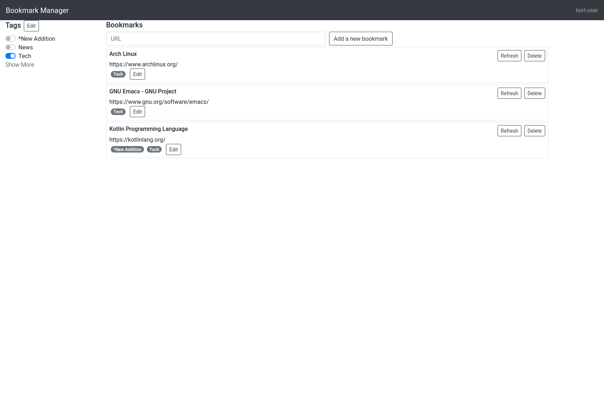

# Bookmark manager (Kotlin multiplatform)


A web-application to manage bookmarks.



## Key features

### Tagging

A bookmark can have zero or more tags. By clicking tags on the side panel,
bookmarks with selected tags are displayed in the main pane.

To reduce clutter, tags are categorised into primary and secondary. Primary tags
are shown by default on the side pane, and secondary tags are shown only after
"Show More" is clicked.

### Ordering by relevance

The bookmarks are listed in the order of their relevance, such that the bookmark
with the highest relevance appears at the top of list. The relevance is inferred
with the browsing history, as implemented in `bookmark-scorer` library
([Link](https://github.com/tkngch/bookmark-scorer)).

## How to use

The distribution TAR file is available at the release page
([Link](https://github.com/tkngch/bookmark-manager/releases)). Untar the
distribution, and execute the entrypoint `bin/bookmark-manager`.

This application is build with Java 11.

### Dependency

The application requires one external dependency (libtorch) on the server
side. libtorch is freely available at [this
page](https://pytorch.org/get-started/locally/). The application does not use
CUDA, so the CPU-only version of libtorch is sufficient. After downloading and
unzipping, define an environment variable so that the application can find
libtorch.

```
BOOKMARK_MANAGER_OPTS=-Djava.library.path=<path to libtorch/lib>
```

### Configure

By default, the application runs in the development mode, which uses the
in-memory database so no bookmark is stored in the disk. Switch to the
production mode by setting the environment variable:

```
BOOKMARKMANAGER_ENV=production
```

and optionally, set the port

```
BOOKMARKMANAGER_PORT=8000
```

Then the web UI is available at `http://localhost:$BOOKMARKMANAGER_PORT`. The
default port is 8081.

### Add a user

To add a user, create `$XDG_DATA_HOME/bookmark-manager/users.json`. In case where
`XDG_DATA_HOME` is not set, create
`$HOME/.local/share/bookmark-manager/users.json`. This json file defines a list
of users with their hashed password. For example, the content can be

```
[
    {
        "username": "test-user",
        "password": "XohImNooBHFR0OVvjcYpJ3NgPQ1qq73WKhHvch0VQtg="
    }
]
```

in which case one user `test-user` is recognised by the application. Each entry
is expected to have "username" and "password" fields. Value of "password" field
should be the hashed password. The hashed password can be obtained with the
following shell command:

```
echo -n $password | openssl dgst -binary -sha256 | openssl base64
```

For example,

```
echo -n 'password' | openssl dgst -binary -sha256 | openssl base64
```

gives us

```
XohImNooBHFR0OVvjcYpJ3NgPQ1qq73WKhHvch0VQtg=
```

which appears in the above example.

## To do

- Tag recommendation, to predict which tags are more likely to be added to each bookmark.

## Won't do

- User management

  The assumption is that I am the only user of this application for the
  foreseeable future. As such, there is no plan to add "sign up" functionality
  within the application UI.

- Log-out feature.

  This application uses the basic-authentication, with which it is not
  straightforward to let users log-out. The current plan is to wait for `Ktor`
  to support an authentication method with a log-out feature: for example, the
  session authentication method.
